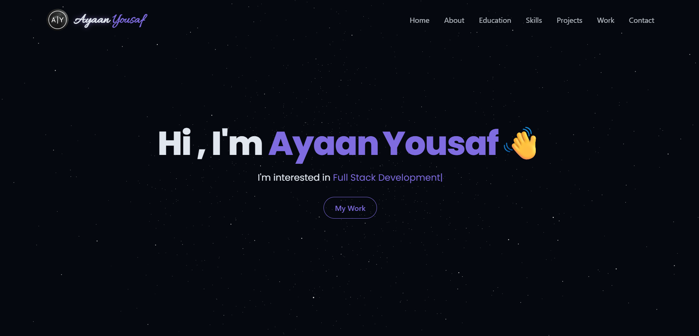

# 3D Portfolio Website

## Overview
A personal developer portfolio to showcase projects, skills, experience, and more! A modern and interactive web application built with React.js, Vite, Tailwind CSS, and Three.js. A stunning 3D space background, responsive design with smooth animations, and an interactive 3D Earth model.

## 🌐 Live Demo
Check out a live demonstration of the project at [www.ayaanyousaf.ca](https://www.ayaanyousaf.ca)! 
Deployed using Vercel.

## 🚀 Features
- Immersive Visuals: Captivate your users with beautiful Three.js 3D visuals. 
- Dynamic Sections: View all of the content in one scroll, all sections are dynamic with React.js.
- Responsive Design: Leverages Tailwind CSS to ensure consistent styling on all devices.
- Smooth Animations: Modern scrolling animations with Framer Motion.
- Contact Form API: A working contact form with seamless EmailJS integration.

## 🛠️ Tech Stack
- **Core:** React 19, Vite, React Router
- **Styling & UI:** Tailwind CSS, Lucide React, Radix UI (Toast)
- **Animations:** Framer Motion, React Type Animation
- **3D Graphics:** Three.js, @react-three/fiber, @react-three/drei
- **Integrations:** EmailJS
- **Deployment:** Vercel

## 📝 License 
- This project is open-source and license under the [MIT License](./LICENSE).
